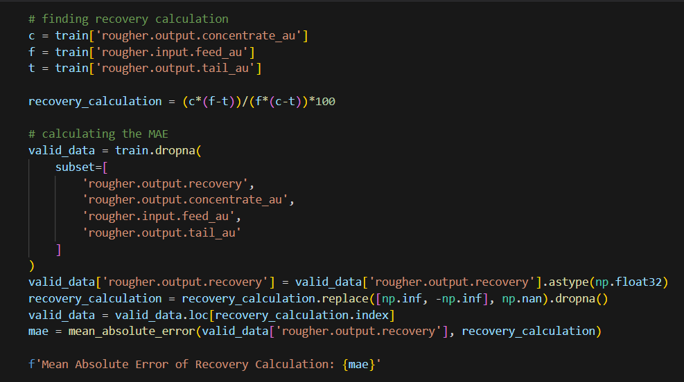
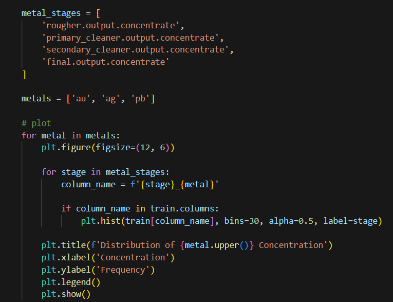
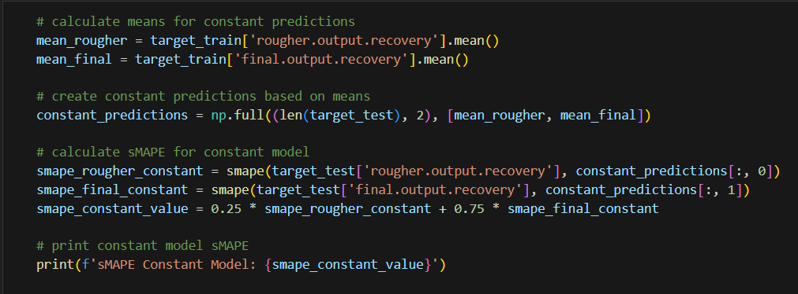

# Integrated Project

## Intro

This project is the 10th project I worked on during my time with the TripleTen program. This was one of the most difficult in terms of technicality and real-world application. Despite this difficulty, I completed it with efficiency and more importantly, learned a great deal from this project. I was tasked with preparing a prototype of a machine learning model for Zyfra - a company that develops efficiency solutions for heavy industry. The model needed to predict the amount of gold recovered from gold ore. 

### The Data

The data is stored in three files:

* gold_recovery_train.csv — training dataset 
* gold_recovery_test.csv — test dataset 
* gold_recovery_full.csv — source dataset 

The source dataset contains the training and test sets with all the features. Data is indexed with the date and time of acquisition (date feature). Some parameters are not available because they were measured and/or calculated much later. That's why, some of the features that are present in the training set may be absent from the test set. The test set also doesn't contain targets.

### The Process

I dove into this project with the main intentions of first cleaning the data, performing EDA, then finally building the model. When beginning, preprocessing was the first to occur by simply checking the overall structure and accuracy of the data. Once that was correct I moved onto some analysis consisting mainly of ensuring proper recovery calculation and investiating the feature differences between the datasets. Upon completing this, I then moved to prepare for model training by merging the datasets, assigning feature / target variables - which was interesting for me as it was my first time working with two targets. Once everything was defined, I did some final analysis on the various metals, purification stages, and related connections. There was also the presence of visualization to help present these findings. Finally, it was time to build the model. I trained various regression models and proceeded to cross validate, and find the sMAPE, MAE, and RMSE values for each of these models to evaluate which would be the best one for final testing. I was looking for low percentage error and high accuracy. Then to close, I conducted final testing, final metric evaluation, and a sanity check. 

### Results
There were a few main takeaways from this project:

* I found that gold increased with each subsequent stage while silver went down, and lead essentially stayed around the same amount. Keeping in mind the purpose of the process, this information made sense.
* When I examined the feed particle distribution between the training and test set, the values were matching up, giving security that the values received from the models would be accurate. 
* The beginning of the recovery process is when there's the most amount of substances present. Then the amount decreases as the stages progress, but the concentration also increases. The gold increases while the others decrease. 
* The sanity check showed that the RandomForestRegressor model is performing at a high rate, handling variability and patterns well.

All of this information will no doubt be useful in the hopes to help maximize production efforts while also eliminating unprofitable parameters.

### Images 

