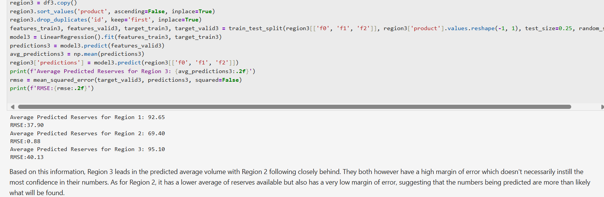
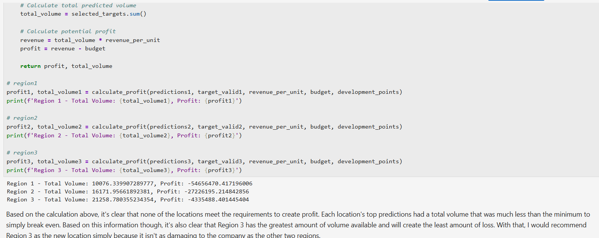

# Machine Learning in Business 

## Intro

This is from the 9th course of this program. With a focus on business usage, there was an importance placed on statistical analysis and logical thinking, which I personally enjoyed. The project task put me in the shoes of an employee for the OilyGiant mining company, which needed to find a new place for a new well. I needed to build a model that will help to pick the region with the highest profit margin.

### The Data

Geological exploration data for the three regions are stored in files:

* geo_data_0.csv.
* geo_data_1.csv. 
* geo_data_2.csv. 

* id — unique oil well identifier
* f0, f1, f2 — three features of points (their specific meaning is unimportant, but the features themselves are significant)
* product — volume of reserves in the oil well (thousand barrels).

### The Process

I began this project by of course performing preprocessing which consisted of creating a continuous structure throughout all data and cleaning any incorrect / unnecessary values. Keeping the project task in mind, I moved onto using a LinearRegression model to predict profit of each region - which was based on the volume of oil present. I then made use of the bootstrapping technique and found the average profit, 95% confidence interval, and risk of loss for each of the three regions. With this information, I was able to confidently propose a region for development to the company. 

### Results

There were a few main takeaways from this project:

* During model training / testing the average amount of volume that each region contained pointed at Region 3 having the most promise. There was however a large margin of error for this region.
* It was found that each region needed to contain a minimum of just over 11 thousand volumes of oil per well in order to produce a profit for OilyGiant. Although none of the regions met that qualification, Region 3 had the least amount of loss.
* The threshold for the risk of loss that the new location needed to meet was 2.5%, and only Region 2 met this standard. 

Region 2 was ultimately chosen as the location for the new well. This decision was made with the consideration that OilyGiant will make profit from this new region, and that based on the RMSE values and risk of loss percentage, they will have security in their decision to invest in this location. This project highlighted the importance of balance in one's business aspirations. 

### Images 

