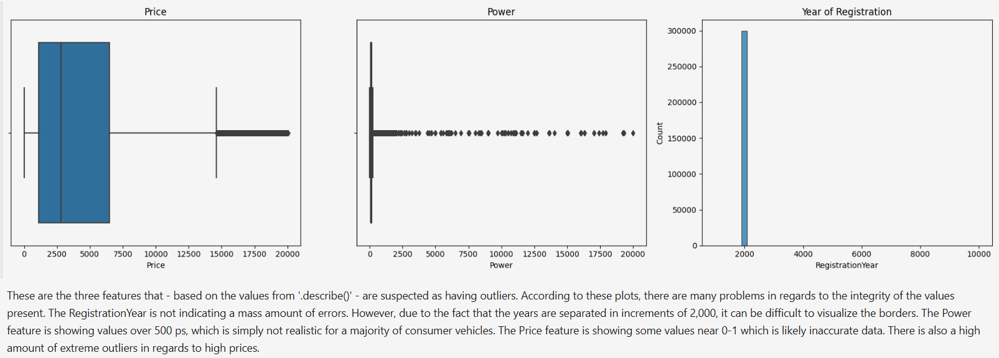
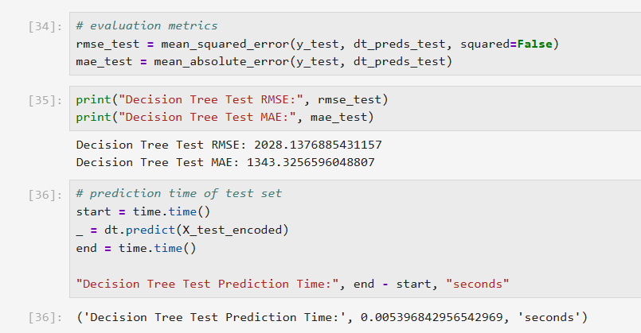

# Numerical Methods

## Intro
This project was the evaluation of a course focused on various numerical methods and building training algorithms based on those methods. In this project I was tasked to assist Rusty Bargain (a used car sales service) with attracting new customers. To do so, I was to build a model that would be used on an app available for customers to determine the value of their car. 

### The Data

The dataset is stored in the following file with the subsequent features / target:

* /datasets/car_data.csv 

* DateCrawled — date profile was downloaded from the database
* VehicleType — vehicle body type
* RegistrationYear — vehicle registration year
* Gearbox — gearbox type
* Power — power (hp)
* Model — vehicle model
* Mileage — mileage (measured in km due to dataset's regional specifics)
* RegistrationMonth — vehicle registration month
* FuelType — fuel type
* Brand — vehicle brand
* NotRepaired — vehicle repaired or not
* DateCreated — date of profile creation
* NumberOfPictures — number of vehicle pictures
* PostalCode — postal code of profile owner (user)
* LastSeen — date of the last activity of the user
* Price — price in Euros (target)

### The Process

I began this project with preprocessing to ensure the data had a continuous format as well as cleaning out any incorrect / non-beneficial values. This preprocessing was also completed with the help of data visualization. I then prepared for model training by defining my variables and neutralizing the data. I trained three different models and compared each by their RMSE values (main evaluation metric). I also conducted further analysis, specifically on the speed of each model. With speed and quality now established, I chose one model for final testing. Adding MAE as one of the final evaluation metrics, I concluded final testing and was confident in my proposition for a model to the company.  

### Results

There were a few main takeaways from this project:

* There were a great many outliers in a small handful of features, which were quickly fixed so as not to skew the data while being trained. 
* For RMSE and MAE the LightGBM model performed the best, but when it came to processing speed, the DecisionTree had outperformed the other two. This was the model used for final testing.
* During final testing, it was found that the model had a good balance of quality and speed, while also having room for improvement. 

In the future when tasked with a similar project, I will proceed to further tune the hyperparameters in order to have the most efficient model available for the company. Based on the information I had gathered, I could only suggest that Rusty Bargain take use of the DecisionTree model as it was the most rounded in terms of quality and speed. This would be the most effective in assisting them with their app which will undoubtedly attract new customers and retain current ones.

### Images

 