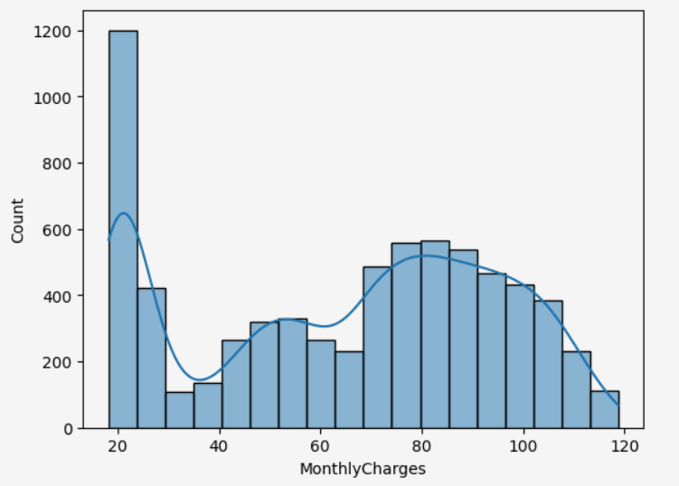
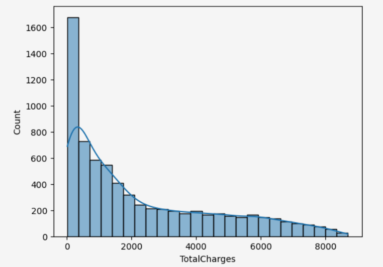
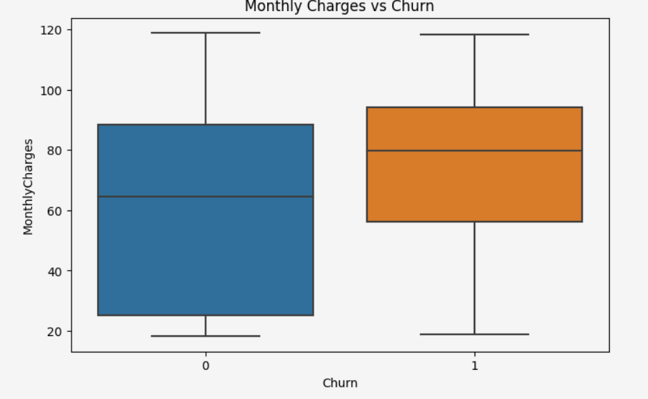
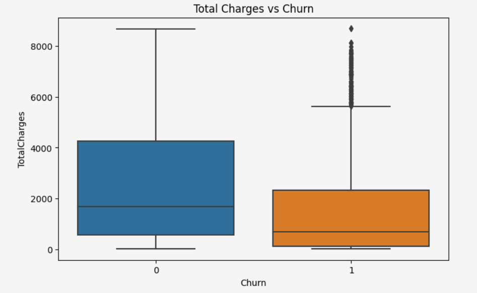

# Final Project

## Intro
This project was to conclude everything I had learned in my duration with this bootcamp. It was also meant to simulate the process of working with a real company. The project task is to build a machine learning model that will be able to forecast the churn of clients for the telecom operator Interconnect. 

### The Data

Interconnect mainly provides two types of services:

* Landline communication. The telephone can be connected to several lines simultaneously.
* Internet. The network can be set up via a telephone line (DSL, digital subscriber line) or through a fiber optic cable.

Some other services the company provides include:

* Internet security: antivirus software (DeviceProtection) and a malicious website blocker (OnlineSecurity)
* A dedicated technical support line (TechSupport)
* Cloud file storage and data backup (OnlineBackup)
* TV streaming (StreamingTV) and a movie directory (StreamingMovies)

The data consists of files obtained from different sources:

* contract.csv — contract information
* personal.csv — the client's personal data
* internet.csv — information about Internet services
* phone.csv — information about telephone services

In each file, the column customerID contains a unique code assigned to each client. Target feature: the 'EndDate' column equals 'No'. 

### The Process

I began this project by of course preprocessing the data, ensuring it is correctly formatted and ready for EDA / model testing. This was done through value manipulation, conversion, and filling of values. Once complete, I moved on to EDA. Keeping the project task in mind, this section was mainly geared towards understanding the relationships of various factors that may cause a customer to leave the company. This was done by looking at distributions, trends, and corresponding visualizations. Holding onto all of this newfound information, I shifted into machine learning preparation by defining my variables and manipulating the necessary data. Upon having prepared the data, it was now time to train three separate models, comparing these three with the primary metric of AUC-ROC and the additional metric of Accuracy. Once establishing my top performing model, I performed my final testing and, of course, a sanity check to confirm the efficacy of the model. Only once this was completed at a high level was I able to confidently recommend a model for Interconnect to utilize. 

### Results

There are a few main takeaways from this project:

* It was found that customers who had low-commitment (in terms of contracts, specifically) with the company had a very high chance of leaving. Also, the company does well with attracting new clients, but not necessarily with longevity of keeping those clients.
* It was discovered during EDA that there was a massive class imbalance and there was a good handful of features (which may have caused overfitting) - which was carefully considered when choosing the appropriate models. 
* Final testing with the XGB model produced an AUC-ROC score of 0.91 and an accuracy score of 0.86. The model did great at generalizing and working with data it hadn't yet encountered.
* The sanity check confirmed this and gave confidence that the model was truly learning patterns and was confident in its predictions.

I am secure with the decision to be able to present this model to Interconnect for use. This will no doubt be able to assist with pinpointing clients that may be leaving the company and in turn offer services or promotions to keep their satisfaction and loyalty. This will not only benefit the company financially but will also help their reputation and also increase customer experience.

### Images

 
